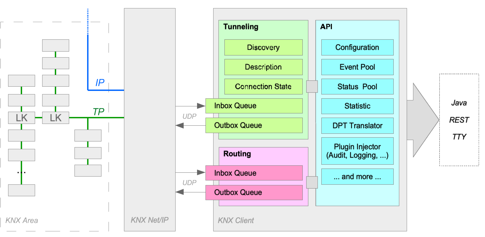

[](https://github.com/pitschr/knx-core/actions)
[](https://coveralls.io/github/pitschr/knx-core?branch=main)
[](https://www.gnu.org/licenses/gpl-3.0)
[](https://search.maven.org/search?q=g:%22li.pitschmann%22%20a:%22knx-core%22)

# KNX Core

A reactive, non-blocking Java library for KNX Net/IP communication.

The purpose of this library is designed for developers to allow their applications 
to communicate with KNX world via their KNX Net/IP device (either a KNX router or a 
KNX interface). _Tunneling_ and _routing_ modes are supported.

For a demo application see [knx-demo-tty-monitor](https://github.com/pitschr/knx-demo-tty-monitor)
and for first examples see [knx-examples](https://github.com/pitschr/knx-examples).

### Known limitations

* No KNX Secure which are offered by newest generation of KNX Net/IP devices 
(because I do not have a KNX router that supports KNX secure)

### Prerequisites

* **Java 11+**
  * Make sure that you have Java 11+ installed and running as Java 11+
* **Tunneling: KNX Router or Interface**
  * One free tunneling connection available
  * IP-Address (optional, if not provided - the auto-discovery service will be used)
* **Routing: KNX Router only**
  * Filter table on your KNX router device is properly configured, otherwise packets won't 
  be forwarded
  * IP Multicast Address that is used by your KNX router (optional, if not provided, the 
  default 224.0.23.12 multicast address will be used)
  

## Architecture



The communication between KNX Net/IP device and the KNX client is reactive and non-blocking 
which allows a very fast communication and we may have multiple channels simultaneously open: 
* _Discovery Channel_ for discovery service (multicast)
* _Description Channel_ for receiving description information
* _Control Channel_ for tunneling; control-related frames like connect, disconnect and connection state
* _Data Channel_ for tunneling; data-related frames like read/write requests from and to KNX
* _Multicast Channel_ for routing; data-related frames

## Communication modes

According to the KNX specification the communication is defaulted to _tunneling_ mode and without 
Network Address Translation (NAT). The knx-core also offers the communication using _routing_
instead of tunneling.

#### Tunneling without NAT (default, recommended)

```
DefaultKnxClient.createStarted();                   // IP Address resolved using discovery service
DefaultKnxClient.createStarted("192.168.0.3");      // Defined IP Address with default KNX Port
DefaultKnxClient.createStarted("192.168.0.3:1234"); // Defined IP Address with custom KNX Port
```

Using `ConfigBuilder` we can configure the KNX Client like above:

```
var config = ConfigBuilder.tunneling().build();     
var config = ConfigBuilder.tunneling(address).build();     
var config = ConfigBuilder.tunneling(address, port).build();
     
DefaultKnxClient.createStarted(config);
```

#### Tunneling with NAT

Network Address Translation (NAT) is available for _tunneling_ mode only; for _routing_
NAT is not required. Sometimes we need NAT, eg. in dockerized image. To use the NAT we 
need to enable it explicitly by `true`:

```
var config = ConfigBuilder.tunneling(true).build(); 
var config = ConfigBuilder.tunneling(address, true).build();     
var config = ConfigBuilder.tunneling(address, port, true).build();     

DefaultKnxClient.createStarted(config);
```

#### Routing

If you specific an IP Address that is in a Class D address (i.e. four first bits of the address are 1110, 
, CIDR notation "224.0.0.0/4") then it is a IP multicast address and for this purpose the _routing_ 
communication will be used automatically. The standardized IP multicast address for KNX is `224.0.23.12`.

```
DefaultKnxClient.createStarted("224.0.23.12"); // IP Multicast Address (KNX Specification)
DefaultKnxClient.createStarted("224.1.2.3");   // IP Multicast Address (Custom)
```

You can use the `ConfigBuilder` to define the _routing_ mode:

```
var config = ConfigBuilder.routing().build();     
var config = ConfigBuilder.routing(address).build();  
var config = ConfigBuilder.routing(address, port).build();   

DefaultKnxClient.createStarted(config);  
```

## Data Point

In KNX every group object is a data point and it represents data. In order to have a standardized
interpretation of the data the _Data Point Type_ (DPT) have been introduced by the KNX Association
to define _how the data is encoded_.

The KNX Client supports various data point types and is designed to translate data point types in 
a fluent way into a KNX byte-array compatible format. Following are supported:

| DPT    | Description                                | DPT    | Description                                |
| ------ | ------------------------------------------ | ------ | ------------------------------------------ |
| 1.xxx  | Binary                                     | 21.xxx | 8-Bit Flagged Messages                     |        
| 2.xxx  | Controlled Binary                          | 22.xxx | 16-Bit Flagged Messages                    |
| 3.xxx  | Controlled Step/Interval                   | 23.xxx | 2-Bit Enumeration                          |
| 4.xxx  | Character                                  | 24.xxx | ISO-8859-1 Characters (variable length)    |
| 5.xxx  | 8-Bit Unsigned Value                       | 25.xxx | 2-Nibble Set                               |
| 6.xxx  | 8-Bit Signed Value                         | 26.xxx | Scene Information                          |
| 7.xxx  | 2-Octet Unsigned Value                     | 27.xxx | Combined Info On/Off                       |
| 8.xxx  | 2-Octet Signed Value                       | 28.xxx | UTF-8 Characters (variable length)         |
| 9.xxx  | 2-Octet Float Value                        | 29.xxx | 8-Octet Signed Value Electrical Energy     |
| 10.xxx | Time                                       |
| 11.xxx | Date (Year: 1990..2089)                    |         
| 12.xxx | 4-Octet Unsigned Value                     |
| 13.xxx | 4-Octet Signed Value                       |
| 14.xxx | 4-Octet Float Value                        |   
| 15.xxx | Access Data                                |
| 16.xxx | 14-Octet Characters                        | 
| 17.xxx | Scene Number                               | 
| 18.xxx | Controlled Scene Number                    | 
| 19.xxx | Date and Time (Year: 1900..2155)           | 
| 20.xxx | 8-Bit Enumeration                          |

Based on [article](https://support.knx.org/hc/en-us/articles/115001133744-Datapoint-Type) from KNX Association 
the DPT1 until DPT20 are most often used data point types.

For other DPTs which are not on the list yet, you can either implement the Data Point Type by yourself 
by extending the `DataPointType`. Alternatively use the built-in `DPTRaw` whereas the raw value is in 
byte array format.

Given example, we want to get data point for date and time that represents `Saturday, 2013-08-17 04:10:45`. 
According to the data point type table above we would use the DPT19 which is `19.001`:

```
var dayOfWeek = DayOfWeek.SATURDAY;
var date = LocalDate.of(2013, 8, 17);
var time = LocalTime.of(04, 10, 45);

DPT19.DATE_TIME.of(dayOfWeek, date, time);
```

The KNX Client was also designed to provide a less barrier using human-friendly text:
```
DPT19.DATE_TIME.of("Saturday", "04:10:45", "2013-08-17"); // All information
DPT19.DATE_TIME.of("2013-08-17", "04:10:45");             // Only date and time
DPT19.DATE_TIME.of("04:10:45", "2013-08-17");             // Order doesn't matter, auto-detecting
```

## Group Address

The KNX Group Address represents the destination address of the telegram for an action; eg. switch on 
lamp. In order to be operational at least two group objects to be linked; one for sending telegram and one for 
receiving the telegram.

In ETS we have three types of group address structures which are all stored in a data length of 16 
bits (2 octets):
* Three-Level: Main, Middle and Sub (Range: `0/0/1 - 31/7/255`)
* Two-Level: Main and Sub (Range: `0/1 - 31/2047`)
* Free-Level: Address (Range: `1 - 65535`)

From KNX topology point of view `1/2/100`, (Three-Level) `1/612` (Two-Level) and `2660` (Free-Level) 
represents the same group address.

```
GroupAddress.of(int, int, int); // Three-Level Structure
GroupAddress.of(int, int);      // Two-Level Structure
GroupAddress.of(int);           // Free-Level Structure
GroupAddress.of(String);        // Auto-detecting and parsing based on format
```

## Individual Address

The KNX Individual Address defines the location of the device within the KNX topology.

The Individual Address is represented in a data length of 16 bits (2 octets) with a fixed structure 
and in a range from `0.0.1` - `15.15.255`. First is the _Area_, middle is the _Line_ and last is 
the _Device Address_. The Individual Address `0.0.0` is not allowed, and represents the `undefined` state.

```
IndividualAddress.of(int, int, int); // Area, Line and Device Address
IndividualAddress.of(String);        // Format: "<Area>.<Line>.<Device Address>" (e.g. "1.2.3")
```

## KNX Core Development

This section is written for experienced Java developers and explains how to integrate the 
KNX client with your own application. Use the `try-with-resources` to create and start
the KNX communication. The closure of KNX communication will be handled automatically by
the KNX client then: 

##### Java
```
try (var client = DefaultKnxClient.createStarted("address:port")) {
    // do something...
}
```

##### Kotlin
```
DefaultKnxClient.createStarted("address:port").use { client ->
    // do something...
}
```

Below are some practical first-to-use examples. For more examples, see 
[knx-examples](https://github.com/pitschr/knx-examples) repository. 

### Example: Switch on/off lamp with boolean values

Let's start with an easy sample: You want to switch `on` a lamp. The KNX actuator listens 
on group address `1/2/110` which is configured for switching on/off a lamp. For this case we have to use the KNX `DPT1`
for 1-bit values, it is the same what you have to define in the ETS that is used to configure the KNX infrastructure:

##### With Java:
```java
public final class LampOnExample {
   public static void main(final String[] args) {
        // this is the group address where the KNX actuator listens to switch on/off a lamp
        final var groupAddress = GroupAddress.of(1, 2, 110);

        // create KNX client and connect to KNX Net/IP device using auto-discovery
        try (final var client = DefaultKnxClient.createStarted()) {
            // switch on the lamp (boolean: true) --> translated to '0x01' and sent to KNX Net/IP device
            client.writeRequest(groupAddress, DPT1.SWITCH.of(true));  // or DPT1.SWITCH.of((byte)0x01)
                                                                      // or DPT1.SWITCH.of("on")
        }

        // auto-closed and disconnected by KNX client
    }
}
```

##### With Kotlin:
```kotlin
fun main() {
    // this is the group address where the KNX actuator listens to switch on/off a lamp
    val groupAddress = GroupAddress.of(1, 2, 110);
    DefaultKnxClient.createStarted().use { client ->

        // switch on the lamp (boolean: true) --> translated to '0x01' and sent to KNX Net/IP device
        client.writeRequest(groupAddress, DPT1.SWITCH.of(true));  // or DPT1.SWITCH.of((byte)0x01)
                                                                  // or DPT1.SWITCH.of("on")
    }
}
```

#### Example: Inverse the lamp status

Given sample, you want to inverse the status of your lamp: 
* if the lamp is `on`, the lamp should be `off`
* if the lamp is `off`, the lamp should be `on`

To get the most recent status of lamp, we need this information from the KNX actuator. As
per KNX Project Design Guidelines we have multiple KNX group addresses, here in our example
the group address `1/2/110` is responsible for switching on/off the lamp (=write). The group address
`1/2/113` is used for status feedback of the lamp (=read). 

```java
public final class LampInverseExample {
    public static void main(final String[] args) {
        // this is the group address where the KNX actuator returns the status of lamp
        final var readGroupAddress = GroupAddress.of(1, 2, 113);

        // this is the group address where the KNX actuator listens to switch on/off the lamp
        final var writeGroupAddress = GroupAddress.of(1, 2, 110);

        // create KNX client and connect to KNX Net/IP device using auto-discovery
        try (final var client = DefaultKnxClient.createStarted()) {
            // send a 'read' request to KNX
            client.readRequest(readGroupAddress);

            // KNX actuator will send a response to the KNX client with actual lamp status
            final var status = client.getStatusPool().getValue(readGroupAddress, DPT1.SWITCH).getValue();

            // lamp status will be inverted (on -> off / off -> on)
            final var statusInverted = !status;

            // send a 'write' request to KNX
            client.writeRequest(writeGroupAddress, DPT1.SWITCH.of(statusInverted));
        }

        // auto-closed and disconnected by KNX client
    }
}
```

## KNX Core Configuration

The default configuration settings used by KNX Client are as per KNX Specification 
but gives you some freedom to adjust some configurations; e.g. change to use another
KNX port which differs from the officially registered KNX port `3671` at IANA.

All KNX Core configurations can be found in: [CoreConfigs.java](src/main/java/li/pitschmann/knx/core/config/CoreConfigs.java) 

| Name | Type | Default Value | Description |
| ---- | ---- | ------------- | ----------- |
| NAT | `Boolean` | `false` | Enable/Disable the NAT for *tunneling* communication. <br><br> **Communication:** Tunneling <br> **Config Field:** `li.pitschmann.knx.core.config.CoreConfigs.NAT` <br> **Config Key:** `client.nat.enabled` |
| KNX Project Path | `Path` | Latest `*.knxproj` file in current work directory. | Absolute path to the `*.knxproj` file that is created/maintained by ETS tool. <br><br> **Config Field:** `li.pitschmann.knx.core.config.CoreConfigs.PROJECT_PATH` <br> **Config Key:** `project.path` |
| **Search** |
| Request Timeout | `Long` | `10000` milliseconds | Timeout for *search requests* to find KNX Net/IP device in your network using multicast. <br><br> **Communication:** Tunneling (Discovery Channel, multicast)<br> **Config Field:** `CoreConfigs.Search.REQUEST_TIMEOUT` <br> **Config Key:** `client.communication.search.requestTimeout` |
| **Description** |
| Request Timeout | `Long` | `10000` milliseconds | Timeout for *description requests* to fetch device information about KNX Net/IP device. <br><br> **Communication:** Tunneling (Description Channel) <br> **Config Field:** `CoreConfigs.Description.REQUEST_TIMEOUT` <br> **Config Key:** `client.communication.description.requestTimeout` |
| Local Port | `Integer` | `0` (=random free port) | Port that should be bound by KNX Client on local machine. <br><br> **Communication:** Tunneling (Description Channel) <br> **Config Field:** `li.pitschmann.knx.core.config.CoreConfigs.Description.PORT` <br> **Config Key:** `client.communication.description.port` |
| Socket Timeout | `Long` | `3000` milliseconds | Timeout for description channel socket. <br><br> **Communication:** Tunneling (Description Channel) <br> **Config Field:** `li.pitschmann.knx.core.config.CoreConfigs.Description.SOCKET_TIMEOUT` <br> **Config Key:** `client.communication.description.socketTimeout` |
| **Connect** |
| Request Timeout | `Long` | `10000` milliseconds | Timeout for *connect requests* to establish a *tunneling* connection to KNX Net/IP device. <br><br> **Communication:** Tunneling (Control Channel) <br> **Config Field:** `li.pitschmann.knx.core.config.CoreConfigs.Connect.REQUEST_TIMEOUT` <br> **Config Key:** `client.communication.connect.requestTimeout` |
| **Disconnect** |
| Request Timeout | `Long` | `10000` milliseconds | Timeout for *disconnect requests* sent to KNX Net/IP device. <br><br> **Communication:** Tunneling (Control Channel) <br> **Config Field:** `li.pitschmann.knx.core.config.CoreConfigs.Disconnect.REQUEST_TIMEOUT` <br> **Config Key:** `client.communication.disconnect.requestTimeout` |
| Response Timeout | `Long` | `1000` milliseconds | Timeout for *disconnect response* from KNX Net/IP device after disconnect request. <br><br> **Communication:** Tunneling (Control Channel) <br> **Config Field:** `li.pitschmann.knx.core.config.CoreConfigs.Disconnect.RESPONSE_TIMEOUT` <br> **Config Key:** `client.communication.disconnect.responseTimeout` |
| **Connection State** |
| Request Timeout | `Long` | `10000` milliseconds | Timeout for *connection state requests* for request if KNX Net/IP device is still reachable. <br><br> **Communication:** Tunneling (Control Channel) <br> **Config Field:** `li.pitschmann.knx.core.config.CoreConfigs.ConnectionState.REQUEST_TIMEOUT` <br> **Config Key:** `client.communication.connectionState.requestTimeout` |
| Heartbeat Interval | `Long` | `60000` milliseconds | Interval when *connection state requests* should be sent to KNX Net/IP device. <br><br> **Config Field:** `li.pitschmann.knx.core.config.CoreConfigs.ConnectionState.HEARTBEAT_INTERVAL` <br> **Config Key:** `client.communication.connectionState.heartbeatInterval` |
| Heartbeat Timeout | `Long` | `120000` milliseconds | Ultimate timeout when disconnect sequence should be initiated by KNX Client when no *connection state response* was received. <br><br> **Communication:** Tunneling (Control Channel) <br> **Config Field:** `li.pitschmann.knx.core.config.CoreConfigs.ConnectionState.HEARTBEAT_TIMEOUT` <br> **Config Key:** `client.communication.connectionState.heartbeatTimeout` |
| **Control Channel**
| Local Port | `Integer` | `0` (=random free port) | Port that should be bound by KNX Client on local machine for all control channel related packets. <br><br> **Config Field:** `li.pitschmann.knx.core.config.CoreConfigs.Control.PORT` <br> **Config Key:** `client.communication.control.port` |
| Socket Timeout | `Long` | `3000` milliseconds | Timeout for control channel socket <br><br> **Config Field:** `li.pitschmann.knx.core.config.CoreConfigs.Control.SOCKET_TIMEOUT` <br> **Config Key:** `client.communication.control.socketTimeout` |
| **Tunneling** |
| Request Timeout | `Long` | `1000` milliseconds | Timeout for *tunneling requests* sent to KNX Net/IP device. <br><br> **Communication:** Tunneling (Data Channel) <br> **Config Field:** `li.pitschmann.knx.core.config.CoreConfigs.Tunneling.REQUEST_TIMEOUT` <br> **Config Key:** `client.communication.tunneling.requestTimeout` |
| **Data Channel**
| Local Port | `Integer` | `0` (=random free port) | Port that should be bound by KNX Client on local machine for all data channel related packets. <br><br> **Communication:** Tunneling <br> **Config Field:** `li.pitschmann.knx.core.config.CoreConfigs.Data.PORT` <br> **Config Key:** `client.communication.data.port` |
| Socket Timeout | `Long` | `3000` milliseconds | Timeout for data channel socket. <br><br> **Communication:** Tunneling <br> **Config Field:** `li.pitschmann.knx.core.config.CoreConfigs.Data.SOCKET_TIMEOUT` <br> **Config Key:** `client.communication.data.socketTimeout` |
| **Remote Endpoint** |
| Address | `InetAddress` | `unbound` (uses discovery) | Remote IP Address of KNX Net/IP device. <br><br> **Communication:** Tunneling (Control and Data Channel) <br> **Config Field:** `not available` <br> **Config Key:** `client.endpoint.address` |
| Port | `Integer` | `3671` | Port of KNX Net/IP device to accept KNX requests. <br><br> **Communication:** Tunneling (Control and Data Channel) <br> **Config Field:** `not available` <br> **Config Key:** `client.endpoint.port` |
| **Multicast** |
| Address | `InetAddress` | `224.0.23.12` | Multicast Address that may be joined by KNX Net/IP device. <br><br> **Communication:** Routing, Tunneling (Search only) <br> **Config Field:** `li.pitschmann.knx.core.config.CoreConfigs.Multicast.ADDRESS` <br> **Config Key:** `client.communication.multicast.address` |
| Port | `Integer` | `3671` | Port of Multicast that may be joined by KNX Net/IP device. <br><br> **Communication:** Routing, Tunneling (Search only) <br> **Config Field:** `li.pitschmann.knx.core.config.CoreConfigs.Multicast.PORT` <br> **Config Key:** `client.communication.multicast.port` |
| Time-To-Live (TTL) | `Integer` | `4` hops | Defines the range over which a multicast packet is propagated in your intranet. <br><br> **Communication:** Routing, Tunneling (Search only) <br> **Config Field:** `li.pitschmann.knx.core.config.CoreConfigs.Multicast.TIME_TO_LIVE` <br> **Config Key:** `client.communication.multicast.timeToLive` |
| Socket Timeout | `Long` | `3000` milliseconds | Timeout for multicast channel socket. <br><br> **Communication:** Routing, Tunneling (Search only) <br> **Config Field:** `li.pitschmann.knx.core.config.CoreConfigs.Multicast.SOCKET_TIMEOUT` <br> **Config Key:** `client.communication.multicast.socketTimeout` |
| **Communication** |
| Executor Pool Size | `Integer` |`10` | The size of communicator thread pool size that may send packets in parallel. <br><br> **Communication:** Routing, Tunneling <br> **Config Field:** `li.pitschmann.knx.core.config.CoreConfigs.Communication.EXECUTOR_POOL_SIZE` <br> **Config Key:** `client.communication.executorPoolSize` |
| **Plugin** |
| Executor Pool Size | `Integer` | `10` | The size of plugin thread pool size that may notify plugins in parallel. <br><br> **Config Field:** `li.pitschmann.knx.core.config.CoreConfigs.Plugin.EXECUTOR_POOL_SIZE` <br> **Config Key:** `client.plugin.executorPoolSize` |
| Initialization Timeout | `Long` | `10000` milliseconds | Timeout how long a plugin may take for initialization before it is rejected by the plugin manager <br><br> **Config Field:** `li.pitschmann.knx.core.config.CoreConfigs.Plugin.INITIALIZATION_TIMEOUT` <br> **Config Key:** `client.plugin.initializationTimeout` |
