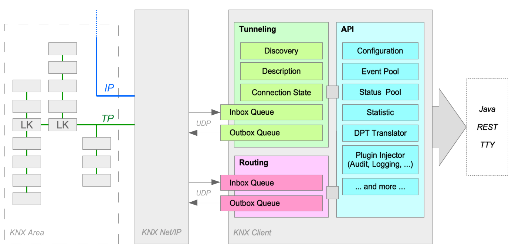

[](https://travis-ci.org/pitschr/knx-link)
[](https://coveralls.io/github/pitschr/knx-link?branch=master)
[](https://www.gnu.org/licenses/gpl-3.0)

# KNX Link

A reactive, non-blocking Java library for KNX Net/IP communication.

The purpose of this library is designed for developers to allow their applications 
to communicate with KNX world via KNX Net/IP device (either a KNX router or a KNX 
interface) and it supports _tunneling_ and _routing_ modes.
 
For examples, to get a quick start see examples below. It contains few _main classes_ 
to get a quick basic understanding how the communication with KNX can be done in 
programmatically way.

### Known limitations

* No KNX Secure which are offered by newest generation of KNX Net/IP devices 
(because I do not have a KNX router that supports KNX secure)
 
### Prerequisites

* **Java 11+**
  * Make sure that you have Java 11+ installed and running as Java 11+
* **Tunneling: KNX Router or Interface**
  * One free tunneling connection available
  * IP-Address (optional, if not provided - the auto-discovery service will be used)
* **Routing: KNX Router only**
  * Filter table on your KNX router device is properly configured, otherwise packets won't 
  be forwarded
  * IP Multicast Address that is used by your KNX router (optional, if not provided, the 
  default 224.0.23.12 multicast address will be used)

### Architecture



The communication between KNX Net/IP device and the KNX client is reactive and non-blocking 
which allows a very fast communication and we may have multiple channels simultaneously open: 
* _Discovery Channel_ for discovery service (multicast)
* _Description Channel_ for receiving description information
* _Control Channel_ for tunneling; control-related frames like connect, disconnect and connection state
* _Data Channel_ for tunneling; data-related frames like read/write requests from and to KNX
* _Multicast Channel_ for routing; data-related frames

#### Communication mode (Tunneling, NAT, Routing)

According to the KNX specification the communication is defaulted to _tunneling_ mode and without 
Network Address Translation (NAT). If you have multiple KNX Net/IP devices and want to specify
the IP-Address use the `--ip <address[:port]>`. If the communication should be using _routing_ instead
of tunneling then it must be explicitly defined using `--routing` argument.

Using _tunneling_ mode we need Network Address Translation (NAT) in some cases; this must be 
enabled using `--nat` parameter. When NAT enabled, then the _Control Channel_ and _Data Channel_ 
will use a shared channel.  One practical example, where we need NAT would be e.g. dockerized image. 
NAT is suitable for _tunneling_ mode only, in _routing_ mode it has no
effect.

#### KNX Client

All data-related frames of all KNX group addresses that is sent by KNX Net/IP device will be 
fetched and handled by the KNX client and it offers:
* _Status Pool_ to fetch the latest status and data about the KNX group address
* _Event Pool_ for more advanced and detailed diagnosis and stores the original request and 
response frames 
frame belongs to which request frame for more advanced and detailed diagnosis
* _Statistic_ to get basic statistic how many bytes/frames/type of frames were sent or received
* _Plugin Injector_ allowing to extend KNX client with plugin, for example: auditing, long-term 
event logging, and much more.
* _Data Point Type Translator_ to translate human-friendly (e.g. "on", "off"), Java data types 
(e.g. true, false) into KNX compatible byte representation; and vice versa 

### Data Point Types

This KNX library (incl. KNX Client) supports following data point types below and is designed to 
translate data point types in a fluent way into a KNX byte-array compatible format.

| DPT    | Description              | DPT    | Description                      | DPT    | Description             |
| ------ | ------------------------ | ------ | -------------------------------- | ------ | ----------------------- |
| 1.xxx  | Binary                   | 11.xxx | Date (Year: 1990..2089)          | 21.xxx | 8-Bit Flagged Messages  |        
| 2.xxx  | Controlled Binary        | 12.xxx | 4-Octet Unsigned Value           | 22.xxx | 16-Bit Flagged Messages |
| 3.xxx  | Controlled Step/Interval | 13.xxx | 4-Octet Signed Value             | 23.xxx | 2-Bit Enumeration       |
| 4.xxx  | Character                | 14.xxx | 4-Octet Float Value              | 
| 5.xxx  | 8-Bit Unsigned Value     | 15.xxx | Access Data                      |
| 6.xxx  | 8-Bit Signed Value       | 16.xxx | 14-Octet Characters              |
| 7.xxx  | 2-Octet Unsigned Value   | 17.xxx | Scene Number                     |
| 8.xxx  | 2-Octet Signed Value     | 18.xxx | Controlled Scene Number          |
| 9.xxx  | 2-Octet Float Value      | 19.xxx | Date and Time (Year: 1900..2155) |
| 10.xxx | Time                     | 20.xxx | 8-Bit Enumeration                |

## Quick Start Guides

### KNX Monitoring

**Class:** [`li.pitschmann.knx.main.KnxMainMonitoring`](knx-core/src/main/java/li/pitschmann/knx/main/KnxMainMonitoring.java)

**Arguments:**
* `-t`, `--time` the time in seconds how long the monitoring should run (default: _"infinity"_)
* `-p`, `--knxproj` KNX project file (default: _latest *.knxproj in the folder_)

**Monitoring between KNX Net/IP device and KNX client**

Start monitoring for one hour (`3600` seconds). After one hour a disconnect request
frame will be sent by the KNX client to the KNX Net/IP device to close the communication
gracefully and the application will exit.

```shell
# Tunneling (auto-discovery)
java -cp <file>.jar li.pitschmann.knx.main.KnxMainMonitoring -t 3600
# Tunneling (auto-discovery with NAT)
java -cp <file>.jar li.pitschmann.knx.main.KnxMainMonitoring --nat -t 3600
# Tunneling (IP Address)
java -cp <file>.jar li.pitschmann.knx.main.KnxMainMonitoring --ip 192.168.1.16 -t 3600
# Tunneling (IP Address with NAT)
java -cp <file>.jar li.pitschmann.knx.main.KnxMainMonitoring --ip 192.168.1.16 --nat -t 3600
# Routing
java -cp <file>.jar li.pitschmann.knx.main.KnxMainMonitoring --routing -t 3600
```

### Send a WRITE request frame to KNX

**Class:** [``li.pitschmann.knx.main.KnxMainWrite``](knx-core/src/main/java/li/pitschmann/knx/main/KnxMainWrite.java)

**Arguments:**
* `-ga`, `--groupAddress` the KNX group address which has a _write_ flag
* `-dpt`,`--dataPointType` the KNX Data Point Type
* `-v`, `--value` a sequence of commands that is compatible with KNX Data Point Type argument

**Switching lamp on KNX group address `1/2/50`**

Perform a DPT1 - Switch (`1.001`) _write request_ action on KNX group address `1/2/50` to switch 
`on` and then `off` a lamp. For demo purposes the delay between commands is hardcoded with two seconds.

```shell
# Tunneling (auto-discovery)
java -cp <file>.jar li.pitschmann.knx.main.KnxMainWrite -ga 1/2/50 -dpt 1.001 -v on off
# Tunneling (auto-discovery with NAT)
java -cp <file>.jar li.pitschmann.knx.main.KnxMainWrite --nat -ga 1/2/50 -dpt 1.001 -v on off
# Tunneling (IP Address)
java -cp <file>.jar li.pitschmann.knx.main.KnxMainWrite --ip 192.168.1.16 -ga 1/2/50 -dpt 1.001 -v on off
# Tunneling (IP Address with NAT)
java -cp <file>.jar li.pitschmann.knx.main.KnxMainWrite --ip 192.168.1.16 --nat -ga 1/2/50 -dpt 1.001 -v on off
# Routing
java -cp <file>.jar li.pitschmann.knx.main.KnxMainWrite --routing -ga 1/2/50 -dpt 1.001 -v on off
```

For sequence of commands you may use e.g. `(-v|--value) on off on off` to switch on/off the lamp twice
times. 
 
### Send a READ request frame to KNX

**Class:** [`li.pitschmann.knx.main.KnxMainRead`](knx-core/src/main/java/li/pitschmann/knx/main/KnxMainRead.java)

**Arguments:**
* `-ga`, `--groupAddress` the KNX group address which has a _read_ flag
* `-n`, `--loops` number of read requests

**Read the actual status of a lamp on KNX group address `1/2/113`**

Send a _read request_ frames to KNX group address `1/2/113` up to `10` times. For demo purposes the delay 
between read requests is hardcoded with one second.

```shell
# Tunneling (auto-discovery)
java -cp <file>.jar li.pitschmann.knx.main.KnxMainRead -ga 1/2/113 -n 10
# Tunneling (auto-discovery with NAT)
java -cp <file>.jar li.pitschmann.knx.main.KnxMainRead --nat -ga 1/2/113 -n 10
# Tunneling (IP Address)
java -cp <file>.jar li.pitschmann.knx.main.KnxMainRead --ip 192.168.1.16 -ga 1/2/113 -n 10
# Tunneling (IP Address with NAT)
java -cp <file>.jar li.pitschmann.knx.main.KnxMainRead --ip 192.168.1.16 --nat -ga 1/2/113 -n 10
# Routing
java -cp <file>.jar li.pitschmann.knx.main.KnxMainRead --routing -ga 1/2/113 -n 10
```

## Programming

This tutorial is written for experienced Java developers and explains how to integrate the 
KNX client with your own application. It looks like:

```
// Creates KNX client and start communication with your KNX Net/IP.
// The closure of KNX communication will be handled automatically by KNX client.
try (final var client = DefaultKnxClient.createStarted("address:port")) {
    // do your stuff you want to do ...
} catch (final Throwable t) {
    // catch all throwable you want to handle here (optional)
} finally {
    // do final actions (optional)
}
```

#### Example: Switch on/off lamp with boolean values

Let's start with an easy sample: You want to switch `on` a lamp. The KNX actuator listens 
on group address `1/2/110` which is configured for switching on/off a lamp. 

```java
public final class ExampleLampOn {
    public static void main(final String[] args) {
        // this is the group address where the KNX actuator listens to switch on/off a lamp
        final var groupAddress = GroupAddress.of(1, 2, 110);

        // create KNX client and connect to KNX Net/IP device using auto-discovery
        try (final var client = DefaultKnxClient.createStarted()) {
            // switch on the lamp (boolean: true) --> translated to '0x01' and sent to KNX Net/IP device
            client.writeRequest(groupAddress, DPT1.SWITCH.toValue(true));  // or DPT1.SWITCH.toValue((byte)0x01)
                                                                           // or DPT1.SWITCH.toValue("on")
        }

        // auto-closed and disconnected by KNX client
    }
}
```

#### Example: Inverse the lamp status

Given sample, you want to inverse the status of your lamp: 
* if the lamp is `on`, the lamp should be `off`
* if the lamp is `off`, the lamp should be `on`

To get the most recent status of lamp, we need this information from the KNX actuator. As
per KNX Project Design Guidelines we have multiple KNX group addresses, here in our example
the group address `1/2/110` is responsible for switching on/off the lamp (=write). The group address
`1/2/113` is used for status feedback of the lamp (=read). 

```java
public final class ExampleLampInverse {
    public static void main(final String[] args) {
        // this is the group address where the KNX actuator returns the status of lamp
        final var readGroupAddress = GroupAddress.of(1, 2, 113);

        // this is the group address where the KNX actuator listens to switch on/off the lamp
        final var writeGroupAddress = GroupAddress.of(1, 2, 110);

        // create KNX client and connect to KNX Net/IP device using auto-discovery
        try (final var client = DefaultKnxClient.createStarted()) {
            // send a 'read' request to KNX
            client.readRequest(readGroupAddress);

            // wait a bit (usually few milliseconds, but up to 1 second maximum)
            // KNX actuator will send a response to the KNX client with actual lamp status
            final var lampStatus = client.getStatusPool().getValue(readGroupAddress, DPT1.SWITCH).getBooleanValue();

            // lamp status will be inverted (on -> off / off -> on)
            final var lampStatusInverted = !lampStatus;

            // send a 'write' request to KNX
            client.writeRequest(writeGroupAddress, DPT1.SWITCH.toValue(lampStatusInverted));
        }

        // auto-closed and disconnected by KNX client
    }
}
```

#### Example: Plugin

This sample is demonstrating how we can implement and register the plugin in direct way.
Here we want to print out the incoming and outgoing packets in format and this sample
is a good one to get a better understanding which packets are sent for KNX communication.

By writing own plugin we have thousand of possibilities, some examples are: Auditing, 
Advanced Statistics, Logic, API, Integration to third-party applications (Grafana, Kafka, ...)

```java
public final class ExamplePlugin {
    public static void main(final String[] args) {
        // we want to monitor the KNX traffic for 60 seconds
        final var endTimeMillis = System.currentTimeMillis() + 60000;

        final var config = ConfigBuilder
                .tunneling()  // communication mode: tunneling
                .plugin(new MyPlugin()) // register my plugin
                .build(); // create immutable config

        // create KNX client and connect to KNX Net/IP device using auto-discovery
        try (final var client = DefaultKnxClient.createStarted(config)) {
            // loop until the time ends
            while (System.currentTimeMillis() < endTimeMillis) {
                System.out.println("Ping ...");
                Sleeper.seconds(3);
            }
        }

        // auto-closed and disconnected by KNX client
    }

    public static class MyPlugin implements ObserverPlugin {

        @Override
        public void onIncomingBody(@Nonnull Body item) {
            System.out.println("Incoming: " + item.getServiceType().getFriendlyName() + " (" + item.getRawDataAsHexString() + ")");
        }

        @Override
        public void onOutgoingBody(@Nonnull Body item) {
            System.out.println("Outgoing: " + item.getServiceType().getFriendlyName() + " (" + item.getRawDataAsHexString() + ")");
        }

        @Override
        public void onError(@Nonnull Throwable throwable) {
            System.out.println("On Error: " + throwable.getMessage());
        }

        @Override
        public void onInitialization(KnxClient client) {
            System.out.println("Initialized by client: " + client);
        }
    }
}
```

#### Example: Work with Data Point Type

Given snippet, we want to convert a date and time objects into KNX compatible byte array:

```
// Saturday, 2013-08-17 04:10:45
final var dayOfWeek = DayOfWeek.SATURDAY;
final var date = LocalDate.of(2013, 08, 17);
final var time = LocalTime.of(04, 10, 45);

DPT19.DATE_TIME.toByteArray(dayOfWeek, date, time);
```

This can be also more simplified using direct string representation:
```
DPT19.toByteArray("Saturday", "2013-08-17", "04:10:45");
```
